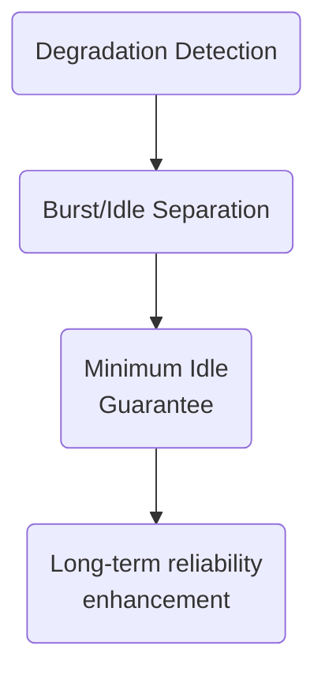
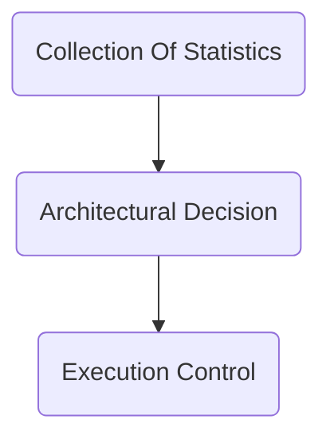
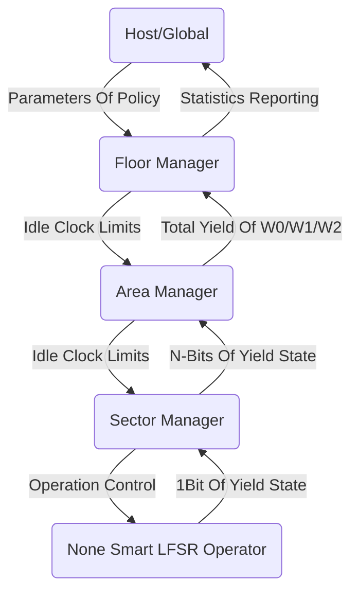
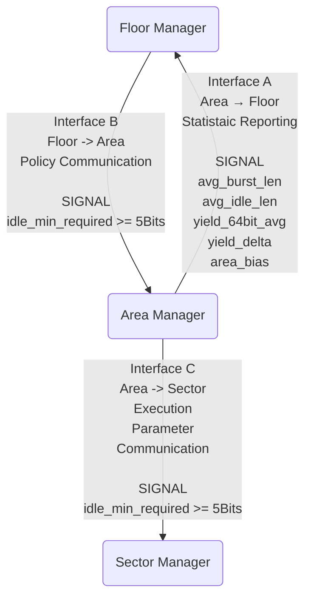
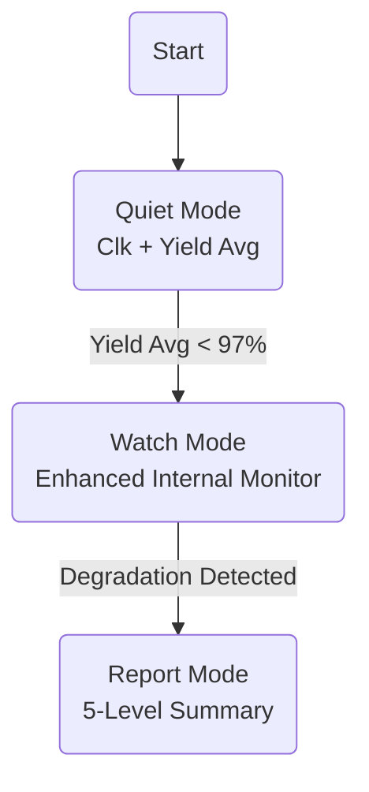
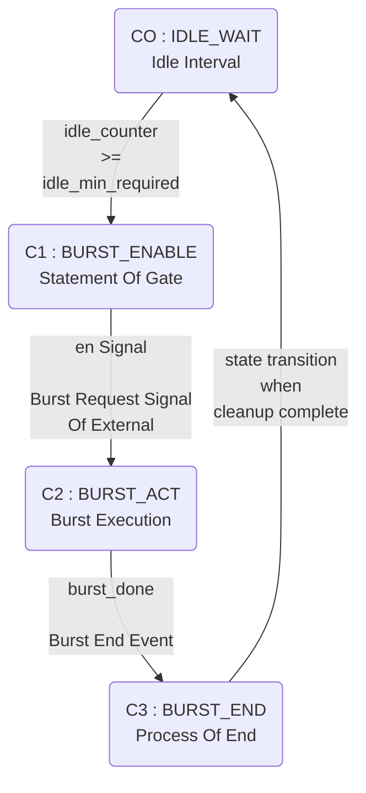
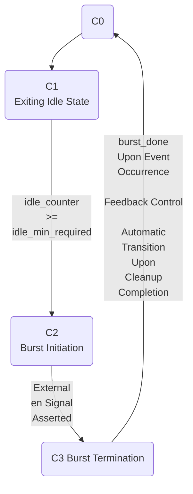

# 1. 설계 목적 및 범위

## 1.1 설계 배경

본 문서는 64-bit Scheduler 기반 시스템에서 연산 유닛의 열화(degradation) 를 구조적으로 관리하기 위한 Idle Scheduling Policy를 정의한다.



---

## 1.2 해결 대상 문제 정의

### 본 정책의 목적은 다음 세 가지이다.

- 연산 성능(burst throughput)을 장기적으로 유지
- 열화의 누적을 통제 가능한 범위로 제한
- 정책 판단과 실행 제어를 계층적으로 분리하여 설계 안정성 확보

---

## 1.3 적용 및 비적용 범위

Idle Scheduling Policy는 연산(burst)과 휴지(idle)를 명확히 분리하고, 정책 판단은 상위 계층에서만 수행되며, 하위 계층은 선언적 기준값만 소비하도록 설계된다.

본 문서는 클러스터 단계부터 상부 보고를 수행하는 구조를 전제로, 열화 전/후 감시 정책을 통합·정리한 설계 명세이다. 하위(none smart lfsr operator, lower scheduler(sectir manager))는 실시간 연산에 집중하며, 상태 분류·요약·보고는 클러스터가 전담한다.

- 열화는 RTL 신호로 존재하지 않는다. 다음 신호들은 열화 계산에 직접 관여하지 않는다:
`idle_counter`
`policy_idx`
`idle_min_required`
- 열화는 오직 상위 계층(Floor/Area)의 통계 연산 결과로만 반영되며, Sector Manager RTL은 열화 개념을 전혀 인지하지 않는다.

---

# 2. 시스템 전체 구조 개요

## 2.1 계층적 시스템 구성

Idle Scheduling Policy는

를 물리적으로 분리하기 위해 3계층 구조를 따른다.

---

## 2.2 데이터 흐름 개괄

### 인터페이스 A : Area → Floor (통계 보고)

- 갱신 타이밍: M-cycle window 종료 시 1회
- 신호:
`avg_burst_len`
`avg_idle_len`
`yield_64bit_avg`
`yield_delta`
`area_bias`

### 인터페이스 B : Floor → Area (정책 전달)

- 갱신 타이밍: AUTO 판단 완료 시
- 신호: `idle_min_required [4:0]` 이상

### 인터페이스 C : Area → Sector (실행 파라미터)

- 갱신 타이밍: 정책 변경 시 또는 reset 시
- 신호: `idle_min_required [4:0]` 이상




---

## 2.3 제어 흐름 개괄

### 상태 전환 플로우 (개념도)



- 모든 전이는 Window 누적 결과로만 결정되며, 사이클 단위 판단 및 이벤트 단발 판단을 금지한다.

---

# 3. 열화(Degradation) 관리

## 3.1 열화의 정의 및 가정

- 열화는 burst 구간에서만 누적된다.
- idle 구간은 열화를 제거하지는 않지만, 누적 속도를 완화하거나 안정화하는 역할을 한다.
- 열화 단계(Level 0~4)는 Cluster에서만 생성되며, 상부에서는 재계산하지 않는다.

---

## 3.2 열화 집중 및 분산 전략

- “열화를 줄이는 장치는, 그 자체가 새로운 열화 원인이 되어서는 안 된다.”
- 본 설계는 3비트 서브 카운터 8개와 3비트 커서를 사용하는 8-way time-multiplexed 카운터 구조를 채택한다. 이는 열화 분산 효과가 실질적으로 확보되는 최소 규모이면서, 커서 관리 및 합산 로직의 복잡도가 과도하게 증가하지 않는 설계적 균형점(sweet spot)이기 때문이다.

---

## 3.3 열화를 관리 대상으로 취급하는 원칙

```
하위는 바쁘다 → 판단/보고 금지
클러스터는 번역기 → 요약/분류 전담
Global/Host 는 판단자 → 단계만 사용
```
정상일수록 조용하게, 문제 생기면 단계로 말한다.

- 수득율 97%는 감시 강도 전환 기준, 수득율 95%는 상태 전이 판단 기준.
- 해당 임계값(97%, 95%)은 절대적 성능 기준이 아니라,
- 통계적 유의성·히스테리시스·운영 안정성의 균형점으로 정의된 상태 전이 기준이다.

---

# 4. 시간 및 주기 제어 개념 (Clock / Window Model)

## 4.1 기본 클럭 정의

- clk는 본 시스템의 기본 동작 클럭으로, 모든 sequential logic 및 always 블록은 clk의 posedge를 기준으로 동작한다.
- clk는 고정 주파수를 전제로 한다.
- clk는 박자(clock tick) 만을 제공하며, 시간 스케일의 조절은 주기 제어 파라미터에 의해 수행된다.

- 기준 클럭: Cluster(floor manager) Clock

---

## 4.2 주기 제어 파라미터(clk_lim)

- clk_lim은 연산 주기 전체의 흐름을 길게 또는 짧게 조절하기 위한 기준 클럭 수를 정의하는 제어 파라미터이다.
- clk_lim은 데이터, 카운터, 통계 대상이 아니다.
- always 블록 내부에서 하나의 연산 주기(W0)가 종료되는 시점을 결정하는 기준으로만 사용된다.

### RTL 관점 사용 위치:

```
if (clk_cnt == clk_lim - 1) begin
    // W0 주기 종료 이벤트
end
```

---

## 4.3 W0 / W1 / W2 주기 계층 구조

본 설계에서 모든 판단은 유효 감시구간(Window) 단위로만 수행된다.

- W0 (Short Window): clk_lim 클럭 (1 주기). 즉시 이벤트 감지 / 레벨 상승 보조. 카운터 없음.
- W1 (Normal Window): 5 * clk_lim (5 주기). 평균 수득율 판단 / 97% 기준. 5bit (0–15) 카운터.
- W2 (Long Window): 20~ * clk_lim (20 주기). 안정성 검증 / 복귀 판단. 8bit (0–255) 카운터.

---

## 4.4 주기 경계 이벤트 정의

- 모든 의미 있는 판단은 W0/W1/W2 주기 경계 이벤트에서만 발생한다.
- W1/W2는 주기 종료 이벤트의 누적 관계로만 정의된다.
- W0 주기 종료 이벤트는 clk_cnt == clk_lim - 1 조건에서만 발생한다.

---

# 5. 계층별 역할 분리 및 책임 경계

## 5.1 none smart lfsr operator의 역할

- 폭: 1비트 출력
- 구성: 약 40(소자의 구성)여개의 트랜지스터
- 역할:
```
연산 수행
수득 상태 비트 전달
```
- 제한:
```
단계 분류 없음
상부 보고 없음
```

---

## 5.2 lower_scheduler (<-64->*7-bit) (sector manager)의 역할

- 폭: 수득치 64bit 출력
- 구성:
- 역할:
```
다수의 none smart lfsr opertor unit 제어
nslfsrop의 인스턴스화시에 UNIT_LENGTH반영
clk_lim 만큼의 클럭에 대하여 수득여부만 카운팅
W1 판단주기마다 정책레벨 연산 주기 반영
nslfsrop연산유닛 burst상태로 연산 수행 유도
```
- 제한:
```
열화 단계 분류 없음
통계를 위한 연산 금지
상부 보고 없음
정책 단계(policy_idx) 미존재
열화 개념 미인지
```

---

## 5.3 middle_scheduler (N-Kbit) (area manager)의 역할

- 역할 :
```
통계산출을 위한 W1/W2 주기의 통계에 필요한 카운터 운영
W1주기마다 Cluster 로부터 전달받은 정책레벨의 연산주기를 lower_scheduler에 전달
lower_scheduler에 clk_lim/nslfsrop의 UNIT_LENGTH전달(인스턴스화 할 때)
Sector 단위 이벤트를 수집하여 middle-term 누계데이터 가공
통계값을 가공 없이 정규화 후 전달
```
- 제한 :
```
정책레벨의 변화가 없을 때는 통계를 위한 카운팅만 수행
정책레벨의 변경에 따른 직접적인 연산주기 변경금지
정책레벨은 연산 강도/주기만 조절하며, 수득 결과 해석에는 사용되지 않는다.
정책 판단 로직 포함 금지 (정책 단계 계산, 임계값 비교, FSM 상태 해석 금지)
```

---

## 5.4 cluster의 역할 (floor manager)

- 역할:
```
하위 상태 집계
middle_scheduler에 clk_lim/nslfsrop의 UNIT_LENGTH전달(인스턴스화 할 때)
시간축 필터링
열화 단계(5단계) 분류
상부 보고 및 상태 모니터링 제공
M-cycle window 기준 통계 입력 수집
AUTO 정책 판단 수식 수행 및 MANUAL bias 적용
최종 idle_min_required 산출
```
- 특징:
```
정책/요약 전담
사람·Global/Host가 이해 가능한 표현 제공
정책 의미 해석 전용 계층
```

---

# 6. 연산 유닛 및 하위 실행 계층 정의

## 6.1 LFSR 및 확률 입력 구조

- none smart lfsr operator unit(연산 유닛)은 1비트 출력을 담당하며, 하위 실행 계층의 핵심 물리적 기반이 된다.
- AI의 연산에 사용되는 확률기반 변동가중치는 외부의 확률 생성 모듈에서 공급받는다.

---

## 6.2 is_yield 생성 규칙

- clk 상승 에지마다:
```
해당 index의 is_yield == 1 인 경우
    W0_CNT[i] 증가
    (8-way wear-leveling 구조 적용 시 W0_SUB_CNT[W0_CURSOR][i] 증가)
```

---

## 6.3 하위 연산 유닛의 무상태성 원칙

- lower scheduler 및 none smart lfsr operator에는 카운터가 존재하지 않는다.
- 모든 카운터는 middle scheduler 관할이다.
- 하위 연산 유닛은 실시간 연산에 집중하며, 상태 정보나 통계를 직접 보유하지 않는 무상태성(Stateless)을 유지한다.

---

# 7. 스케줄러 구조 및 동작 원칙

## 7.1 64비트 최소 단위 스케줄러 개념 (Sector Manager FSM)

본 절은 Sector Manager가 정책을 어떻게 해석하지 않고 소비하는지를 FSM 관점에서 정의한다.

### 상태 인코딩

```
typedef enum logic [1:0] {
  C0_IDLE_WAIT = 2'b00,
  C1_BURST_EN = 2'b01,
  C2_BURST_ACT = 2'b10,
  C3_BURST_END = 2'b11
} fsm_state_t;
```

### 상태 의미

- IDLE_WAIT (C0): burst 이후 회복을 위한 휴지 구간. idle_counter가 증가하며 최소 idle 충족 여부만 판단.
- BURST_ENABLE (C1): 정책 조건 충족 이후, 외부 en 신호에 의해 burst 진입을 분리하기 위한 게이트 상태.
- BURST_ACTIVE (C2): 실제 연산 수행 상태. 정책 변경과 무관하게 burst는 중단되지 않음.
- BURST_END (C3): burst 종료 처리 및 idle 전환 준비 상태.



---

## 7.2 스케줄링 입력 신호 정의 (최소 집합)

### 신호의 방향성 설명

| 신호 | 구분 | 간략한 설명 |
|-------|-------|-----------------|
| clk | input | System Clock |
| rst_n | input | Sync/Async Reset |
| en | input | Burst Request|
| burst_done | input | Burst End Event |
| idle_min_required | input | Minimun Idle<br>Threshold<br>Value<br>(threshold<br>only) |
| burst_en | output | Execution<br>Unit<br>Activation |
| idle_counter |reg | Idle<br>Accumulative<br>Counter |
| state | reg | FSM |

---

## 7.3 스케줄링 출력 및 상위 전달 규칙

burst_en은 C2_BURST_ACT 상태에서만 1'b1로 활성화된다.

### 상태 전이 로직 (조합)
```
always_comb begin
  next_state = state;
  burst_en = 1'b0;
  case (state)
    C0_IDLE_WAIT:
        if (idle_counter >= idle_min_required)
           next_state = C1_BURST_EN;
    C1_BURST_EN:
        if (en)
            next_state = C2_BURST_ACT;
    C2_BURST_ACT:
         begin
             burst_en = 1'b1;
             if (burst_done)
                 next_state = C3_BURST_END;
         end
    C3_BURST_END:
        next_state = C0_IDLE_WAIT;
  endcase
end
```

---

# 8. 통계 수집 및 누적 구조 (W0 / W1 / W2)

## 8.1 W0 카운터 구조 개요 (Short Window)

- 목적: `is_yield`를 `W0` 주기(`clk_lim`) 동안 누적하기 위한 내부 카운터.
- 비트 폭: 
```
W0_CNT_WIDTH = ceil(log2(clk_lim + 1))
```
- 동작: `is_yield == 1` 시 증가. `W0` 주기 종료 시 상위 경로 전달 후 별도 초기화 없이 자연 overwrite.

---

## 8.2 W0 wear-leveling 카운터 구조

특정 레지스터에 열화가 집중되지 않도록 8-way wear-leveling을 적용한다.

- 구조:
```
W0_SUB_CNT[8][UNIT_LENGTH] (3비트 * 8)
W0_CURSOR[UNIT_LENGTH] (3비트)
```

- Invariants: 활성 상태 서브 카운터는 정확히 하나이며, 비활성 카운터는 절대 변경되지 않는다. 커서는 `W0` 주기 경계에서만 `+1 (mod 8)` 갱신된다.
- 결과 산출:
```
W0_VALUE[i] = Σ_{k=0..7} W0_SUB_CNT[k][i].
```
- 주기 경계에서만 합산 수행.

---

## 8.3 W1 중기 누적 구조 (Normal Window)

- 목적: `W0` 주기 결과 5회를 누적한 중기 통계 결과를 상위로 전달.
- 구조:
```
W1_BUF[UNIT_LENGTH]. 비트폭 = W0_CNT_WIDTH + log2(5).
```
- 동작: W0 종료 이벤트 5회 누적 시 결과 계산하여 Cluster 보고 후 덮어쓰기. 저빈도 갱신 구조로 열화 최소화.

---

## 8.4 W2 장기 누적 구조 (Long Window)

- 목적: `W1` 주기 결과 4회를 누적한 장기 통계 결과를 상위로 전달. 추세 분석용 저주파 통계층.
- 구조:
```
W2_BUF[UNIT_LENGTH].
비트폭 = W1_BUF_WIDTH + log2(4).
```
- 동작: `W1` 종료 이벤트 4회 이상 누적 시 결과 계산하여 Cluster 보고 후 덮어쓰기.

---

## 8.5 주기 경계 기반 누적 규칙 (고정 순서)

- 모든 `W1`/`W2` 결과 저장은 아래 순서를 반드시 따른다:
```
주기 종료 이벤트 발생
해당 주기 결과 합산 계산
Cluster 보고
결과 버퍼(W1_BUF / W2_BUF) 덮어쓰기
(명시적 초기화 금지)
```

---

# 9. Idle / Burst 제어 정책 개요

## 9.1 Idle 상태 정의

- RTL 관점 정의: `burst_en == 0` 이며 연산 유닛이 비활성화됨.
- FSM 상태:
```
C0(IDLE_WAIT)
C3(BURST_END)
```
- 기능:
```
C0은 burst 이후 회복을 위한 휴지 구간
idle_counter 가 증가
최소 idle 충족 여부 (idle_min_required) 만 판단함
C3은 burst 종료 처리 및 idle 전환 준비 상태
```
- 동작: idle_counter는 C0 상태에서만 매 cycle 증가하며, C3 진입 시 0으로 초기화됨.

---

## 9.2 Burst 상태 정의

- RTL 관점 정의: `burst_en == 1` 인 동안 연산 유닛이 활성화됨.
- FSM 상태:
```
C1(BURST_ENABLE)
C2(BURST_ACTIVE)
```
- 기능:
```
C1은 정책 조건 충족 이후 외부 en 신호에 의해 burst 진입을 분리하는 게이트 상태
C2는 실제 연산 수행 상태이며 `burst_en` 신호가 assertion
```

---

## 9.3 Idle/Burst 전환 조건



---

# 10. 정책 판단 및 실행 분리 원칙

## 10.1 판단 주체 정의 (Cluster ; Floor Manager)

- 역할:
```
W0/W1/W2-cycle window 기준 통계 레포트 작성
AUTO 정책 판단 수식 수행
MANUAL bias 적용 및 clamp
최종 idle_min_required 산출
```
- 보유 상태:
```
policy_idx_auto
policy_idx_final
```
정책 판단 함수의 형식적 성질:
- 입력: W1/W2 통계 요약값
- 출력: policy_idx_auto (이산 정수)
- 형태: 단조(monotonic) 함수, 비선형 허용
- 시간적 특성: M-cycle 경계에서만 평가
- 원칙: 정책 의미 해석은 Floor 전용이다.

---

## 10.2 통계 산출 주체 정의 (Middle Scheduler ; Area Manager)

- 역할:
```
실행 주체인 Sector Manager로부터 클럭당 yield 상태를 나타내는 64비트를 전달받음.
매 클럭마다 8-way time-multiplexed 카운터 구조를 통해 합산.
W0/W1/W2주기마다 8-way time-multiplexed카운터를 통해 채워진 fill-meter counter를 정책 주체인 Floor Manager에게 전달
```
- 보유상태
```
W0-cycle 8-way time-multiplexed counter
W1-cycle fill-meter counter by W0-cycle
W2-cycle fill-meter counter by W1-cycle
```

---

## 10.3 실행 주체 정의 (Lower Scheduler ; Sector Manager)

- 역할: 전달받은 `idle_min_required`를 FSM 전이 조건으로 사용, burst/idle 실행 제어.
- 제약: 정책 단계(`policy_idx`) 미존재, 통계 연산 미존재, 열화 개념 미인지.
- 원칙: 실행 제어는 Sector 전용이다.

---

## 10.4 정책 신호 전달 규칙 (Interface Hierarchy)

- Floor → Area: `idle_min_required`, `clk_lim` 값만 wire로 전달. 정책 의미를 전달하지 않음.
- Area → Sector: 값을 저장/전달만 수행하며, 재계산/비교/수정 금지.
- 신호 특성: `idle_min_required`, `clk_lim`은 unsigned integer (5 bits 이상) 타입의 순수 파라미터 입력이며, 비교 대상(threshold)으로만 사용됨. 산술 연산 금지.

---

# 11. 감시 모드 및 상태 전이 개념

## 11.1 감시 모드 정의

- Quiet Mode (정상 구간): `W1` 기준 `평균 수득율 ≥ 97%` `W1` 단위 평균 집계만 수행하며 W0/W2 계산 비활성.
- Watch Mode (강화 감시): `W1` 기준 `평균 수득율 < 97%` (연속 N회). 관측 강화 트리거. W0/W1/W2 모니터링 활성.
- Report Mode (열화 구간): `W1`/`W0` 기준 열화 조건 충족 (다중 조건). 5단계 열화 분류 고정 및 단계별 개수 산출 보고.

---

## 11.2 상태 전이 조건 (히스테리시스 연속 조건)

- Quiet → Watch (진입): `W1` 기준 `평균 수득율 < 95%`, 연속 3회 이상 충족 시.
- Watch → Quiet (복귀): `W2` 기준 `평균 수득율 ≥ 95%`, 연속 2회 이상 충족 시 (진입보다 긴 시간축 요구).
- 히스테리시스 마진: 진입 97%미만 (관측 강화), 상태 전이 기준 95% (상태 판단). 복귀 97%이상 (관측 완화).

---

## 11.3 감시 모드 종료 조건 (Report Mode 진입 원칙)

- 진입 논리:
```
REPORT_ENTER = 
    (W1_CORE_COND >= 1)
    AND
    (W0_EVT_COND >= 1)
```
- W1 핵심 조건: 수득율 < TH_DEGRADED, 저하 빈도 증가, 유닛 간 편차 확대 중 1개 이상.
- W0 이벤트 조건: 유닛 보호 트리거, 클럭 제한, 에러 버스트 발생 중 1개 이상.
- 특성: `W1` 또는 `W0` 단독 조건으로는 진입 불가. 진입 후 자동 복귀 없음.
- Report Mode의 의미:
```
Report Mode는 정책 제어를 위한 상태가 아니라
상부 개입을 요청하기 위한 최종 요약 상태이다.
해당 모드에서는 정책 자동 조정은 중단되며,
시스템은 관측과 보고에만 집중한다.
```

---

# 12. 열화 단계 분류 체계

## 12.1 열화 단계 정의 (Level 0~4)

| 단계 | 상태명| 상태값 | 간소 설명 |
|-------|---------|----------|-------------|
| Level 0 | NORMAL | 0 | 정상 운용 |
| Level 1 | AGING | 1 | 경미한 노화 감지 |
| Level 2 | DEGRADED | 2 | 명확한 열화 |
| Level 3 | CRITICAL | 3 | 위험 단계 |
| Level 4 | QUARANTINE | 4 | 격리/회수 대상 |

---

## 12.2 단계 간 전이 규칙

동일 단계 정의를 모든 클러스터에 공통 적용.

- 단조 증가 원칙: 열화 단계는 `W1` 주기 기준 단조 증가 값임. 상승 또는 유지 가능하며 자동 하강은 허용하지 않는다.

'레벨 완화'란 감시 레벨의 완화를 의미하며, 열화 단계 수치의 하강을 의미하지 않음.

---

## 12.3 단계별 허용 동작 범위

- Watch Mode: 단계 분류는 내부 판단 전용으로 사용.
- Report Mode: 5단계 열화 분류값을 고정하고 상부에 5단계 요약 정보(개수 등)를 보고함. 평균 수득율 보고는 중단됨.

---

# 13. 상부 보고(Reporting) 구조 및 인터페이스

## 13.1 보고 대상 및 계층

- 상부 보고 및 상태 모니터링 제공: Cluster(floor manager)가 전담하며 사람·Global/Host가 이해 가능한 표현 제공.
- 정상/강화 감시 구간 보고 항목:
```
CLUSTER_CLK_STATE
CLUSTER_YIELD_AVG
```
- 열화 구간 보고 항목:
```
LV0_CNT
LV1_CNT
LV2_CNT
LV3_CNT
LV4_CNT
WORST_LV
DOMINANT_LV
```

---

## 13.2 보고 주기 정의

- 갱신 타이밍: `W1(M-cycle)` window 종료 시 1회 (인터페이스 A).
- W1/W2 보고: `W1` 주기 종료 시 Cluster에 보고, `W2` 주기 종료 시 Cluster에 보고.
- 원칙: 보고 포맷은 모드에 따라 단일 선택하며 중복 보고 없음.

---

## 13.3 보고 데이터 구성 원칙

- 요약 전담: 상부 보고 데이터는 클러스터 내부 해석 결과이며, 원시 계측값이 아니다.
- Global/Host 제한: 수득율/카운터 직접 해석 금지. Cluster가 제공하는 단계값만 사용.

---

# 14. 인터페이스 신호 원칙 및 금지 규칙

## 14.1 계층 간 접근 제한

- 정책 의미 해석: Floor Manager전용.
- 통계 산출: Area Manager전용.
- 실행 제어: Sector Manager전용.
- 계층 간 신호: 값 전달만 허용. 이 규칙 위반은 튜닝이 아닌 구조 변경으로 간주.

---

## 14.2 직접 참조 금지 규칙

- Sector Manager: 정책 단계(`policy_idx`) 신호 없음. 단계 개수 정보 없음. 오직 `idle_min_required` 값만 존재.
- Area Manager: 정책 단계 계산, 임계값 비교, FSM 상태 해석 금지.
- Global/Host: 열화 계산 금지.

---

## 14.3 신호 방향성 원칙

- Area → Floor: 모든 값은 통계레포트로 가공할 합산치
- Floor → Area: Area는 값을 저장/전달만 수행. 재계산/수정 금지.
- Area → Sector: wire 전달 권장. Sector는 해당 값을 threshold로만 사용.

---

# 15. 검증 관점 설계 불변 조건 (Invariants)

## 15.1 시간 및 주기 관련 불변 조건

> **검증 관점 핵심 선언**
>
> `clk_lim`은 *값이 무엇인지*가 아니라, **주기 경계 이벤트를 생성한다는 사실만**이 검증 대상이다.
> `clk_lim`의 비트폭, 최대값, 산출 근거는 host/global의 책임이며,
> RTL 및 검증 환경은 이를 가정하거나 제한해서는 안 된다.

- `clk_lim`은 항상 주기 경계 판단에만 사용된다. (카운터/확률/통계 사용 금지)
- `W0` 주기 종료 이벤트: `clk_cnt == clk_lim - 1`
- `W1` 종료: `W0` 종료 이벤트 5회 누적
- `W2` 종료: `W1` 종료 이벤트 4회 누적.

---

## 15.2 W0 (wear-leveling) Invariants

- 임의 시점 활성 서브 카운터는 정확히 하나.
`active_cnt = W0_SUB_CNT[W0_CURSOR]`
- 비활성 서브 카운터는 해당 `clk`에서 절대 변경되지 않음.
- 서브 카운터는 증가만 가능 (감소, 리셋, 시프트 금지).
- Saturation 후 값 고정, wrap-around 발생 금지.
- `W0_CURSOR`는 `W0` 주기 경계에서만 변경.

---

## 15.3 W1/W2 계층 불변 조건

- W1: `W0` 주기 종료 시점에만 갱신.
```
W1_CNT_next = W1_CNT_prev + W0_VALUE

//Shift/슬롯 이동/초기화 동작 없음.
```
W2: `W1` 주기 종료 시점에만 갱신.
`W2_CNT_next = W2_CNT_prev + W1_CNT`
- 값은 다음 입력 전달 혹은 보고 완료 전까지 보존되어야 함.

 ---

## 15.4 시스템 레벨 불변 조건

- 단일 `clk` 토글 `W0` 카운터 비트 수 3비트 이하.
- 모든 통계 판단은 주기 경계 이벤트 이후에만 수행.
- Middle scheduler는 판단 미수행, 누적 및 전달만 담당.
- Cluster는 원시 카운터 직접 접근 금지.

다음 테스트 패턴은 무효로 간주한다:
- 주기 경계 외 시점에서의 정책 판단 검증
- 단일 cycle 이벤트에 의존한 열화 단계 변화 검증

---

# 15.5 검증 관점 보안 제외 선언 (Security Exclusion Invariant)

본 설계 블록은 **보안·접근제어·무결성 검증을 수행하지 않는다**는 것을 설계 및 검증 단계에서 명시적으로 선언한다.

- `idle_min_required`, `clk_lim` 및 모든 상위 전달 파라미터는 **정상 경로를 통해 전달된 값**이라는 전제 하에 소비된다.
- Testbench(TB)를 통한 비정상 값 주입, 우회 접근, 강제 파라미터 변조는 **검증 대상에서 제외**되며, 해당 시나리오는 무효 테스트로 간주한다.
- 본 블록은 입력 값의 출처, 권한, 의도, 무결성을 검사하지 않으며, 이를 가정한 방어 로직을 포함하지 않는다.

이는 설계 결함이 아니라 **시스템 분할에 따른 책임 경계 선언**이다.
보안, 접근 제어, 설정 권한 관리는 반드시 본 블록 외부의 상위 시스템 또는 I/O 경계에서 수행되어야 한다.

검증 관점에서 다음 항목은 금지된다:

- TB에서 보안 위협을 가정한 파라미터 크래킹 시나리오
- 상위 제어 계층을 우회한 `clk_lim` / `idle_min_required` 직접 조작
- 비정상 입력을 통한 안정성 또는 FSM 붕괴 검증

허용되는 검증은 다음으로 한정된다:

- 정상 경로 입력에 대한 FSM 전이 정합성 검증
- 주기 경계 이벤트 기반 판단 불변성 검증
- 정책 실행이 선언적 파라미터 소비로만 이루어지는지 확인

---

# 16. 설계 확장성 및 파라미터화 원칙

## 16.1 파라미터 변경 허용 범위 (가변 영역)

- 가중치 계수(w1, w2, w3), 임계값(TH_up, TH_down), M-cycle 길이(1k~64k cycles).
- 각 단계 cycle 값(8/12/16/20/24)은 재산정 시 변경 가능.

---

## 16.2 구조적 확장 시 제약 (불변 영역 / 재설계 간주)

- 정책 단계 수(5) 고정.
- `policy_idx` 이동 폭(±1) 고정.
- 연속 정책 값 도입 금지.
- FSM에서 `D_proxy` 직접 참조 금지.
- 이산 단계 유지 및 FSM 비교 조건 단순성 유지.

---

# 17. 설계 변경 시 영향 범위 규칙

## 17.1 변경 영향 전파 원칙

- 정책 변경은 FSM 상태를 즉시 변경하지 않음.
- 변경된 정책 값은 다음 `C0(IDLE_WAIT)` 구간부터 비교 조건에 반영됨.
- Burst 진행 중 정책 변경은 FSM에 영향 없음 (burst 지속, 길이 불변).

---

## 17.2 재검증 요구 범위

- Idle 대기 중 정책 완화/강화 시 전이 로직 검증.
-AUTO 정책 판단 결과가 `W1(M-cycle)` 경계에서만 수행되며 계단형(step-wise)으로 진행되는지 확인.
- `manual_bias`가 AUTO 판단 결과를 무효화하지 않고 방향성만 조정하는지 검증.

---

# 18. 요약 및 설계 고정 선언

## 18.1 설계 요약

- 정책은 선언적 기준값으로 정의한다.
- 판단은 상위, 실행은 하위 계층에서 수행한다.
- 정책 변화는 항상 점진적이고 예측 가능해야 한다.
- “열화를 줄이는 장치는, 그 자체가 새로운 열화 원인이 되어서는 안 된다.”

---

## 18.2 고정 항목 선언

- v1 기준 명세: 본 문서는 Idle Scheduling Policy의 최종 기준임.
- 한 줄 요약: 수득율 97%는 감시 강도 전환, 95%는 상태 전이 판단 기준.
- 결정적 원칙: 모든 계층은 자신보다 하위 계층의 원시 값을 해석하지 않는다. 열화 단계는 Cluster에서만 생성되며 상부 보고 데이터는 원시 계측값이 아니다.
- FSM 리듬: `clk`는 박자이고, `clk_lim`은 마디 길이이며, 카운터는 그 마디 안에서만 움직인다.

---

# 19. 구현 가이드 및 참고 규칙

## 19.1 RTL 구현 시 권장 사항

- 모든 카운터 증가는 단일 `always_ff` 블록에서만 수행한다.
- 주기 경계 신호(`W0`/`W1`/`W2` 종료)는 combinational 생성 후, sequential 블록에서 1-cycle pulse로 래치하여 사용한다.
- `idle_min_required`, `clk_lim`은 파라미터 또는 상위 wire 입력으로만 취급하며, 내부에서 재정의하지 않는다.
- 비교 연산은 항상 unsigned 기준으로 수행한다.

---

## 19.2 검증(Testbench) 구성 권장

- `W0`/`W1`/`W2` 주기 경계 이벤트를 강제로 발생시키는 시나리오를 포함한다.
- burst 중 정책 변경 시 FSM 상태가 유지되는지 확인한다.
- `idle_min_required` 변화가 `C0(IDLE_WAIT)` 구간에서만 반영되는지 검증한다.
- wear-leveling 서브 카운터의 비활성 불변 조건을 assertion으로 고정한다.

---

# 20. 용어 정의 (Glossary)

| 용어                               | 정의                                                                                                     |
| -------------------------------- | ------------------------------------------------------------------------------------------------------ |
| Idle Scheduling Policy           | 연산(burst)과 휴지(idle)를 분리하고, 열화 관리를 위해 정책 판단과 실행을 계층적으로 수행하는 스케줄링 정책.                                    |
| Degradation (열화)                 | 연산 유닛의 성능 저하 현상. burst 구간에서 누적되며, idle 구간에서는 완화 역할만 수행. 단계(Level 0~4)로 관리.                             |
| Degradation Level                | Cluster에서 분류된 5단계 열화 상태 (Level 0: NORMAL ~ Level 4: QUARANTINE).                                       |
| Policy Level / 정책 단계             | Cluster가 판단하여 하위 계층에 전달하는 idle_min_required 기준값. 하위는 직접 계산하지 않음.                                       |
| AUTO 정책                          | Cluster가 통계 기반으로 idle_min_required 산출을 자동으로 수행하는 정책.                                                   |
| MANUAL bias                      | 운영자가 수동으로 정책 판단에 영향을 주는 조정 값.                                                                          |
| Quiet Mode                       | 기본 상태, 수득율이 정상 범위일 때 유지되는 모드.                                                                          |
| Watch Mode                       | 수득율이 임계치 이하로 하락 시 활성화되는 모니터링 모드.                                                                       |
| Report Mode                      | Degradation 감지 시 5단계 요약 정보를 상위 계층에 보고하는 모드. 정책 자동 조정 중단.                                               |
| Cluster / Floor Manager          | 상위 계층으로, 하위 상태 집계, 열화 단계 분류, 정책 판단, 최종 idle_min_required 산출 담당.                                        |
| Area Manager / Middle Scheduler  | 중간 계층으로, W1/W2 주기 통계를 계산하고 lower scheduler에 정책 레벨과 연산 주기를 전달.                                          |
| Sector Manager / Lower Scheduler | 하위 계층으로, 다수의 none smart LFSR operator를 제어하고, 연산 수행 및 수득 상태 비트를 카운팅.                                    |
| none smart LFSR operator         | 1비트 출력 연산 유닛. 하위 실행 계층에서 실시간 연산 수행. 상태/정책 판단 및 보고 기능 없음.                                               |
| Stateless / 무상태성                 | 하위 연산 유닛이 상태 정보나 통계를 보유하지 않고, 실시간 연산에만 집중하는 설계 원칙.                                                     |
| Burst                            | 연산이 실제로 수행되는 활성 구간. 열화가 누적되는 구간.                                                                       |
| Idle                             | 연산이 수행되지 않는 휴지 구간. 열화 누적은 없으나 완화/안정화 역할 수행.                                                            |
| Yield / 수득율                      | 연산 성공률 또는 성능 달성 비율. Cluster는 이를 기준으로 상태 전이와 정책 판단 수행.                                                  |
| Yield Avg                        | 평균 수득율. 상태 전이 및 정책 판단 시 기준으로 사용.                                                                       |
| W0 / Short Window                | clk_lim 클럭 단위의 단기 감시 주기. 즉시 이벤트 감지 및 레벨 상승 보조.                                                         |
| W1 / Normal Window               | 5 * clk_lim 클럭 단위 주기. 평균 수득율 판단과 정책 레벨 연산.                                                             |
| W2 / Long Window                 | 20 * clk_lim 이상의 장기 주기. 안정성 검증과 정책 복귀 판단 수행.                                                           |
| clk                              | 시스템 기본 동작 클럭. sequential logic과 always 블록의 동작 기준.                                                      |
| clk_lim                          | 주기 제어 파라미터로, 연산 주기 전체 흐름을 조절하는 기준 클럭 수.                                                                |
| M-cycle Window                   | Cluster 기준 통계 입력 수집 단위 주기. W1/W2 판단 및 정책 적용 기준.                                                        |
| Interface A                      | Area → Floor 통계 보고용 인터페이스. avg_burst_len, avg_idle_len, yield_64bit_avg, yield_delta, area_bias 신호 포함. |
| Interface B                      | Floor → Area 정책 전달 인터페이스. idle_min_required 신호 포함.                                                     |
| Interface C                      | Area → Sector 실행 파라미터 전달 인터페이스. idle_min_required 신호 포함.                                               |
| 8-way time-multiplexed counter   | 열화를 분산 관리하기 위해 3비트 서브카운터 8개와 커서를 사용하는 구조.                                                              |
| Wear-leveling                    | 특정 레지스터에 열화가 집중되지 않도록 분산하는 기법. W0 계층에 적용.                                                              |
| 단조 증가 원칙                         | 열화 단계(Level 0~4)는 W1 주기 기준 단조 증가 가능, 자동 하강 금지.                                                         |
| 덮어쓰기 규칙                          | W0/W1/W2 누적 시, 명시적 초기화 없이 다음 주기에 결과를 덮어쓰는 방식.                                                          |
| Assertion / 검증 제한                | clk_lim, 주기 제어 관련 파라미터는 값·비트폭이 아니라 주기 이벤트 생성만 검증 대상으로 함.                                               |
| 보안 범위 제외                         | 본 설계는 암호화, 인증, 접근제어, 무결성 검증 등 보안 기능을 포함하지 않음.                                                          |


---

# 21. 개정 이력 (Revision History)

| 버전 | 날짜 | 변경 내용 |
|------|------|-----------|
| v1.0 | 최초 | Idle Scheduling Policy 초기 기준 명세 확정 |

---

# 22. 보안 범위 제외 및 검증 전제 선언

본 설계 명세에서 정의하는 모든 기능, 제약, 검증 항목은 **보안(Security) 기능을 포함하지 않는다**.

## 22.1 설계 범위 한정 선언

- 본 모듈은 암호화, 인증, 접근 제어, 무결성 검증, 우회 접근 방지 등 **어떠한 형태의 보안 기능도 제공하지 않는다**.
- 보안 관련 요구사항은 본 설계의 목적, 범위, 책임에 포함되지 않는다.
- 보안이 필요한 시스템 구성은 상위 모듈 또는 외부 전용 보안 IP/시스템과의 조합을 전제로 한다.

## 22.2 검증(Testbench) 관점의 명시적 제한

- Testbench(TB)를 이용한 레지스터/파라미터 우회 조작, 비정상 접근, 비인가 시나리오는 **유효한 검증 항목으로 간주하지 않는다**.
- 본 설계의 검증은 정상적인 상위 모듈 인터페이스 및 SDK/제어 경로를 통한 설정만을 전제로 수행한다.
- TB를 통한 의도적 우회 접근은 상위 시스템 설계 이전 단계에서만 허용되는 탐색적 실험으로 한정되며, 본 설계의 결함 또는 취약점으로 해석되지 않는다.

## 22.3 책임 경계 및 법적·특허적 고려

- 본 설계는 보안 메커니즘을 구현하지 않음으로써, 관련 특허 침해 위험을 설계 범위 밖으로 명확히 분리한다.
- 보안 기능의 구현 및 적합성에 대한 책임은 이를 포함하는 상위 시스템 또는 외부 보안 솔루션에 귀속된다.

## 22.4 Q&A 대응용 명시 문장

> 본 IP는 스케줄링 정책과 FSM 안정성에 한정된 기능 블록이며, 보안 기능은 의도적으로 제외되어 있습니다. 보안 요구사항은 검증된 외부 보안 모듈을 통해 충족하는 구성을 전제로 합니다.

---

# 부록 A. W0 / W1 / W2 카운터 구조 정합성 보정 노트

본 부록은 **W0 / W1 / W2 카운터 메모리 맵 정의 문서** 작성 과정에서
본문 설계 명세와 **해석상 충돌하거나 중복될 수 있는 표현을 보정**하기 위해 추가된다.
본 부록은 설계 변경을 의미하지 않으며, **기존 설계 의도를 명확히 단일화**하는 것이 목적이다.

---

## A.1 보정의 범위와 원칙

- 본 보정은 **middle scheduler (area manager)** 내부 카운터 구조에만 적용된다.
- RTL 구현 선택지를 확장하거나 대안을 허용하지 않는다.
- 본문(Idle Scheduling Policy 설계 명세) 및 Invariants와 **완전히 동일한 해석**만 허용한다.

---

## A.2 W1 / W2 슬롯(shift) 구조 관련 보정

### A.2.1 문제 되었던 표현

다음과 같은 개념은 초기 문서 작성 과정에서 **예시적/과거적 표현**으로 포함되었으나,
현재 설계 명세와는 정합되지 않는다.

- W1/W2의 슬롯(slot) 기반 저장 구조
- shift / belt / FIFO 방식 누적
- 다중 슬롯 합산 후 결과 산출 방식

### A.2.2 최종 설계 해석 (정정)

- W1과 W2는 **단일 누적 카운터 구조**이다.
- 슬롯, shift, 벨트 방식의 저장 구조는 **존재하지 않는다**.
- 누적 규칙은 다음으로 고정된다:
```
W1_CNT_next = W1_CNT_prev + W0_VALUE
W2_CNT_next = W2_CNT_prev + W1_CNT
```

- 갱신 시점은 각각 **W0 종료 / W1 종료 이벤트**로만 한정된다.

---

## A.3 (초기화 없음) 표현의 단일 의미 정의

문서 전반에서 사용된 “(초기화 없음)”이라는 표현은 다음의 **단일 의미**로 해석한다.

> 명시적 reset 동작 없이,
> 주기 종료 시 산출된 결과가 다음 주기의 동일 레지스터에 **덮어써진다**.

이는 다음을 포함하지 않는다:
- 값 보존을 위한 추가 레지스터
- 이전 주기 데이터 참조
- 부분 초기화 또는 비트 단위 clear

---

## A.4 W0 구조와의 관계 정합성

- wear-leveling 구조는 **W0 계층에만 존재**한다.
- W1/W2 계층에는 열화 분산 목적의 구조가 존재하지 않는다.
- W0의 커서 이동과 W1/W2 누적 구조는 **역할이 명확히 분리**된다.

---

## A.5 Invariants와의 정합성 선언

본 부록에서 정정된 해석은 다음 섹션과 **완전히 동일한 의미**를 가진다.

- Idle Scheduling Policy 설계 명세
  - §8 통계 수집 및 누적 구조
  - §15 검증 관점 설계 불변 조건 (Invariants)
- W0 / W1 / W2 카운터 메모리 맵 정의 문서
  - §6 Invariants 정의

따라서 본 부록은 **새로운 규칙을 추가하지 않으며**,
기존 설계를 단일 해석으로 고정하기 위한 보정 문서로만 효력을 가진다.

---

## A.6 요약

- W1/W2는 슬롯 기반 구조가 아닌 **단일 누적 카운터**이다.
- shift, belt, FIFO 개념은 최종 설계에서 제거된다.
- W0만이 wear-leveling을 수행한다.
- 본 보정은 설계 변경이 아니라 **해석 충돌 제거**이다.

---

# 부록 B. 검증 관점 Assertion 선언 (해석 금지 규칙)

본 항목은 `clk_lim` 및 주기 제어 관련 파라미터에 대해 **값·범위·비트폭을 검증 대상으로 삼지 않음을 명시적으로 고정**하기 위한 선언이다.

## B.1 Assertion의 목적

본 assertion은 다음을 검증하기 위한 것이 아니다.

- `clk_lim`의 특정 값 적합성
- `clk_lim`의 최소/최대 범위
- `clk_lim`의 비트폭 정의 여부

대신, 본 assertion의 목적은 다음을 **금지**하는 데 있다.

- `clk_lim`이 FSM 상태 전이 조건에 직접 사용되는 행위
- `clk_lim` 값 자체가 정책 판단, 성능 판단, 연산 제한의 의미를 가지도록 해석되는 행위
- 주기 경계 이벤트 외의 용도로 `clk_lim`을 참조하는 설계 또는 검증 가정

## B.2 허용되는 사용 범위 (검증 관점)

다음 사용만이 허용된다.

- `clk_cnt == clk_lim - 1` 형태의 **주기 종료 이벤트 생성**
- W0 주기 경계 신호 발생을 위한 비교 기준값 사용

위 목적 외의 참조는 **설계 의도 위반**으로 간주된다.

## B.3 Testbench에 대한 해석 규칙

- Testbench는 `clk_lim`에 대해 임의의 값, 극단값, 랜덤 값을 자유롭게 인가할 수 있다.
- Testbench는 `clk_lim`의 값에 대해 어떤 안정성, 범위, 의미도 가정해서는 안 된다.
- 상위 모듈(host) 설계가 확정되기 전까지, `clk_lim` 관련 모든 값 가정은 **탐색 행위로서만 허용**된다.

## B.4 책임 경계 선언

- `clk_lim`의 값 의미에 대한 책임은 **상위 모듈(host)** 에 있다.
- middle / lower scheduler는 `clk_lim`을 **시간 스케일 제어용 기준값**으로만 취급하며, 그 의미를 해석하지 않는다.

본 선언은 설계 자유도를 보존하기 위한 것이며, 본 항목을 위반하는 assertion, TB 가정, 또는 설계 변경은 **정책 위반이 아닌 재설계 사유**로 분류된다.

---

# 부록C. 검증 선언 - 보안 요구사항 제외 및 책임 경계

본 설계는 **보안 기능(접근 제어, 무결성 검증, 파라미터 조작 방지, 우회 접근 차단 등)을 설계 범위에 포함하지 않는다**.

본 모듈은 host/global로부터 전달되는 설정 파라미터를  
**신뢰 가능한 입력(trusted input)** 으로 가정하며,  
해당 값의 생성, 보호, 검증에 대한 책임을 갖지 않는다.

다음 사항을 명확히 선언한다.

- 보안 요구사항은 본 모듈의 기능 결함이나 누락 항목이 아니라,  
  **상위 시스템 설계 및 통합 단계에서 정의되어야 할 설계 영역**이다.
- Testbench(TB)를 통한 파라미터 값 변경 또는 비정상 입력 주입은  
  **설계 검증을 위한 일반적인 사용 시나리오로 가정하지 않는다**.  
  해당 방식으로 관측되는 동작은 본 설계의 정상 동작 범위에 포함되지 않는다.
- 본 설계는 보안 메커니즘을 제공하거나 이를 대체하지 않으며,  
  보안이 요구되는 환경에서는 별도의 보안 모듈 또는 외부 시스템을  
  입·출력 경계에서 조합하여 구성하는 것을 전제로 한다.

본 선언은 보안 기능을 배제하기 위한 주장이 아니라,  
**설계 책임 경계와 검증 범위를 명확히 하기 위한 관리적 명세**이다.


